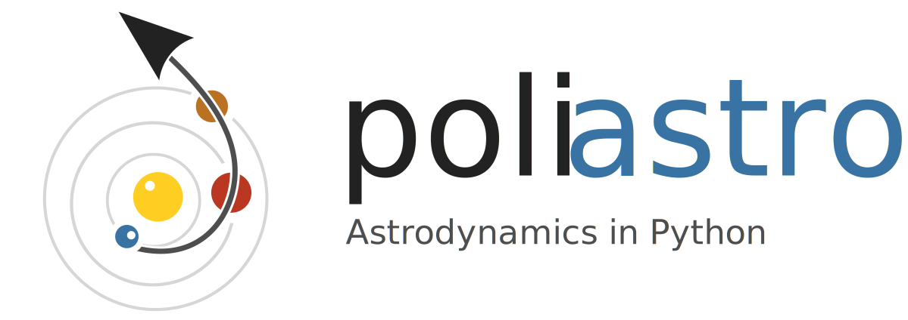

poliastro - Astrodynamics in Python
===================================

**poliastro** is an open source collection of Python subroutines useful in
Astrodynamics and Orbital Mechanics. It tries to provide a simple and
intuitive API and handles physical quantities with units (thanks to
:code:`astropy.units`). Some of its features are:

* Orbit propagation
* Conversion between position and velocity vectors and classical orbital
  elements
* Hohmann and bielliptic maneuvers computation
* Trajectory plotting

And more to come!

The `source code`_, `issue tracker`_ and `wiki`_ are hosted on GitHub, and all
contributions and feedback are more than welcome.

.. _`source code`: https://github.com/poliastro/poliastro
.. _`issue tracker`: https://github.com/poliastro/poliastro/issues
.. _`wiki`: https://github.com/poliastro/poliastro/wiki/

poliastro works on both Python 2 and 3 and is released under
the MIT license, hence allowing commercial use of the library.

.. code-block:: python

    from poliastro.examples import molniya
    from poliastro.plotting import plot
    
    plot(molniya)

.. figure:: _static/molniya.png
   :align: right
   :figwidth: 300
   :alt: Molniya orbit

   Plot of a `Molniya orbit`_ around the Earth
   (\\(a = 26600\\,\\mathrm{km}, e = 0.75,
   i = 63.4 \\mathrm{{}^{\\circ}} \\)).

Older versions of poliastro relied on some Fortran subroutines written by David A. Vallado for
his book "Fundamentals of Astrodynamics and Applications" and available on
the Internet as the `companion software of the book`__.
The author explicitly gave permission to redistribute these subroutines
in this project under a permissive license.

.. __: http://celestrak.com/software/vallado-sw.asp

.. _`Molniya orbit`: http://en.wikipedia.org/wiki/Molniya_orbit

Contents
--------

.. toctree::
   :maxdepth: 2

   getting_started
   user_guide
   changelog
   api

