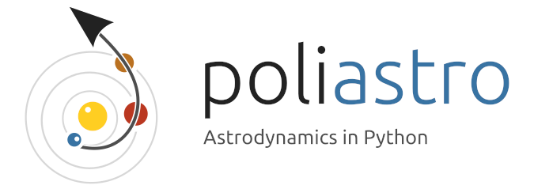
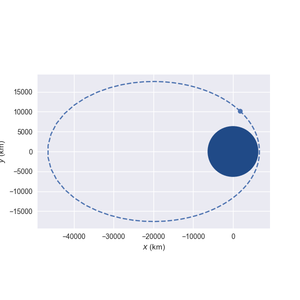

poliastro - Astrodynamics in Python
===================================

**poliastro** is an open source collection of Python subroutines useful in
Astrodynamics and Orbital Mechanics, focusing on interplanetary applications.
It provides a simple and
intuitive API and handles physical quantities with units. Some of its
awesome features are:

   Plot of a `Molniya orbit`_ around the Earth
   (\\(a = 26600\\,\\mathrm{km}, e = 0.75,
   i = 63.4 \\mathrm{{}^{\\circ}} \\)).

* Analytical and numerical orbit propagation
* Conversion between position and velocity vectors and classical orbital
  elements
* Hohmann and bielliptic maneuvers computation
* Trajectory plotting
* Initial orbit determination (Lambert problem)
* Planetary ephemerides (SPICE kernels)

And more to come!

The `source code`_, `issue tracker`_ and `wiki`_ are hosted on GitHub, and all
contributions and feedback are more than welcome:

https://github.com/poliastro/poliastro

.. _`source code`: https://github.com/poliastro/poliastro
.. _`issue tracker`: https://github.com/poliastro/poliastro/issues
.. _`wiki`: https://github.com/poliastro/poliastro/wiki/

You can browse the gallery of examples using `binder`_, a cloud Jupyter notebook server:

image:: https://img.shields.io/badge/launch-binder-e66581.svg?style=flat-square
   :target: http://mybinder.org/repo/poliastro/poliastro

.. _binder: http://mybinder.org/

Release announcements and general discussion take place on our `mailing list`_.
Feel free to join!

.. _`mailing list`: https://groups.io/g/poliastro-dev

https://groups.io/g/poliastro-dev

poliastro works on recent Python versions and is released under
the MIT license, hence allowing commercial use of the library.

.. code-block:: python

    from poliastro.examples import molniya
    from poliastro.plotting import plot
    
    plot(molniya)

.. include:: success.rst

----

.. note::
    Older versions of poliastro relied on some Fortran subroutines written by David A. Vallado for
    his book "Fundamentals of Astrodynamics and Applications" and available on
    the Internet as the `companion software of the book`__.
    The author explicitly gave permission to redistribute these subroutines
    in this project under a permissive license.

.. __: http://celestrak.com/software/vallado-sw.asp

.. _`Molniya orbit`: http://en.wikipedia.org/wiki/Molniya_orbit

Contents
--------

.. toctree::
   :maxdepth: 2

   about
   getting_started
   user_guide
   changelog
   references
   api

