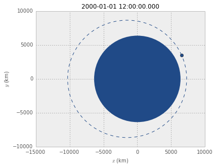
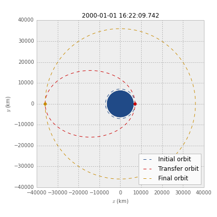
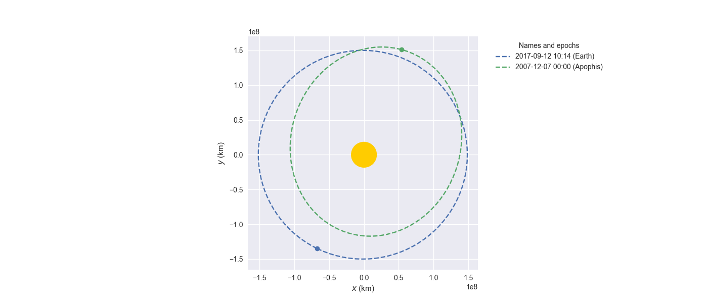

User guide
==========

Defining the orbit: :py:class:`~poliastro.twobody.orbit.Orbit` objects
----------------------------------------------------------------------

The core of poliastro are the :py:class:`~poliastro.twobody.orbit.Orbit` objects
inside the :py:mod:`poliastro.twobody` module. They store all the required
information to define an orbit:

* The body acting as the central body of the orbit, for example the Earth.
* The position and velocity vectors or the orbital elements.
* The time at which the orbit is defined.

First of all, we have to import the relevant modules and classes:

.. code-block:: python

    # If using the Jupyter notebook, use %matplotlib inline
    %matplotlib inline

    import numpy as np
    import matplotlib.pyplot as plt
    from astropy import units as u

    from poliastro.bodies import Earth, Mars, Sun
    from poliastro.twobody import Orbit

    plt.style.use("seaborn")  # Recommended

From position and velocity
~~~~~~~~~~~~~~~~~~~~~~~~~~

There are several methods available to create
:py:class:`~poliastro.twobody.orbit.Orbit` objects. For example, if we have the
position and velocity vectors we can use
:py:meth:`~poliastro.twobody.orbit.Orbit.from_vectors`:

.. code-block:: python

    # Data from Curtis, example 4.3
    r = [-6045, -3490, 2500] * u.km
    v = [-3.457, 6.618, 2.533] * u.km / u.s

    ss = Orbit.from_vectors(Earth, r, v)

And that's it! Notice a couple of things:

* Defining vectorial physical quantities using Astropy units is very easy.
  The list is automatically converted to a :code:`Quantity`, which is actually
  a subclass of NumPy arrays.
* If we display the orbit we just created, we get a string with the radius of
  pericenter, radius of apocenter, inclination and attractor::

    >>> ss
    7283 x 10293 km x 153.2 deg orbit around Earth (♁)

* If no time is specified, then a default value is assigned::

    >>> ss.epoch
    <Time object: scale='utc' format='jyear_str' value=J2000.000>
    >>> ss.epoch.iso
    '2000-01-01 12:00:00.000'

If we're working on interactive mode (for example, using the wonderful IPython
notebook) we can immediately plot the current state::

    from poliastro.plotting import plot
    plot(ss)

This plot is made in the so called *perifocal frame*, which means:

* we're visualizing the plane of the orbit itself,
* the \\(x\\) axis points to the pericenter, and
* the \\(y\\) axis is turned \\(90 \\mathrm{^\\circ}\\) in the
  direction of the orbit.

The dotted line represents the *osculating orbit*:
the instantaneous Keplerian orbit at that point. This is relevant in the
context of perturbations, when the object shall deviate from its Keplerian
orbit.

.. warning::

  Be aware that, outside the Jupyter notebook (i.e. a normal Python interpreter
  or program) you might need to call :code:`plt.show()` after the plotting
  commands or :code:`plt.ion()` before them or they won't show. Check out the
  `Matplotlib FAQ`_ for more information.

.. _`Matplotlib FAQ`: http://matplotlib.org/faq/usage_faq.html#non-interactive-example

From classical orbital elements
~~~~~~~~~~~~~~~~~~~~~~~~~~~~~~~

We can also define a :py:class:`~poliastro.twobody.orbit.Orbit` using a set of
six parameters called orbital elements. Although there are several of
these element sets, each one with its advantages and drawbacks, right now
poliastro supports the *classical orbital elements*:

* Semimajor axis \\(a\\).
* Eccentricity \\(e\\).
* Inclination \\(i\\).
* Right ascension of the ascending node \\(\\Omega\\).
* Argument of pericenter \\(\\omega\\).
* True anomaly \\(\\nu\\).

In this case, we'd use the method
:py:meth:`~poliastro.twobody.orbit.Orbit.from_classical`:

.. code-block:: python

    # Data for Mars at J2000 from JPL HORIZONS
    a = 1.523679 * u.AU
    ecc = 0.093315 * u.one
    inc = 1.85 * u.deg
    raan = 49.562 * u.deg
    argp = 286.537 * u.deg
    nu = 23.33 * u.deg
    
    ss = Orbit.from_classical(Sun, a, ecc, inc, raan, argp, nu)

Notice that whether we create a ``Orbit`` from \\(r\\) and \\(v\\) or from
elements we can access many mathematical properties individually using the
:py:attr:`~poliastro.twobody.orbit.Orbit.state` property of
:py:class:`~poliastro.twobody.orbit.Orbit` objects::

    >>> ss.state.period.to(u.day)
    <Quantity 686.9713888628166 d>
    >>> ss.state.v
    <Quantity [  1.16420211, 26.29603612,  0.52229379] km / s>

To see a complete list of properties, check out the
:py:class:`poliastro.twobody.orbit.Orbit` class on the API reference.

Changing the orbit: :py:class:`~poliastro.maneuver.Maneuver` objects
--------------------------------------------------------------------

poliastro helps us define several in-plane and general out-of-plane
maneuvers with the :py:class:`~poliastro.maneuver.Maneuver` class inside the
:py:mod:`poliastro.maneuver` module.

Each ``Maneuver`` consists on a list of impulses \\(\\Delta v_i\\)
(changes in velocity) each one applied at a certain instant \\(t_i\\). The
simplest maneuver is a single change of velocity without delay: you can
recreate it either using the :py:meth:`~poliastro.maneuver.Maneuver.impulse`
method or instantiating it directly.

.. code-block:: python

    from poliastro.maneuver import Maneuver

    dv = [5, 0, 0] * u.m / u.s
    
    man = Maneuver.impulse(dv)
    man = Maneuver((0 * u.s, dv))  # Equivalent

There are other useful methods you can use to compute common in-plane
maneuvers, notably :py:meth:`~poliastro.maneuver.Maneuver.hohmann` and
:py:meth:`~poliastro.maneuver.Maneuver.bielliptic` for `Hohmann`_ and
`bielliptic`_ transfers respectively. Both return the corresponding
``Maneuver`` object, which in turn you can use to calculate the total cost
in terms of velocity change (\\(\\sum \|\\Delta v_i|\\)) and the transfer
time::

    >>> ss_i = Orbit.circular(Earth, alt=700 * u.km)
    >>> ss_i
    7078 x 7078 km x 0.0 deg orbit around Earth (♁)
    >>> hoh = Maneuver.hohmann(ss_i, 36000 * u.km)
    >>> hoh.get_total_cost()
    <Quantity 3.6173981270031357 km / s>
    >>> hoh.get_total_time()
    <Quantity 15729.741535747102 s>

You can also retrieve the individual vectorial impulses::

    >>> hoh.impulses[0]
    (<Quantity 0 s>, <Quantity [ 0.        , 2.19739818, 0.        ] km / s>)
    >>> hoh[0]  # Equivalent
    (<Quantity 0 s>, <Quantity [ 0.        , 2.19739818, 0.        ] km / s>)
    >>> tuple(val.decompose([u.km, u.s]) for val in hoh[1])
    (<Quantity 15729.741535747102 s>, <Quantity [ 0.        , 1.41999995, 0.        ] km / s>)

.. _Hohmann: http://en.wikipedia.org/wiki/Hohmann_transfer_orbit
.. _bielliptic: http://en.wikipedia.org/wiki/Bi-elliptic_transfer

To actually retrieve the resulting ``Orbit`` after performing a maneuver, use
the method :py:meth:`~poliastro.twobody.orbit.Orbit.apply_maneuver`::

    >>> ss_f = ss_i.apply_maneuver(hoh)
    >>> ss_f
    36000 x 36000 km x 0.0 deg orbit around Earth (♁)

More advanced plotting: :py:class:`~poliastro.plotting.OrbitPlotter` objects
----------------------------------------------------------------------------

We previously saw the :py:func:`poliastro.plotting.plot` function to easily
plot orbits. Now we'd like to plot several orbits in one graph (for example,
the maneuver we computed in the previous section). For this purpose, we
have :py:class:`~poliastro.plotting.OrbitPlotter` objects in the
:py:mod:`~poliastro.plotting` module.

These objects hold the perifocal plane of the first ``Orbit`` we plot in
them, projecting any further trajectories on this plane. This allows to
easily visualize in two dimensions:

.. code-block:: python

    from poliastro.plotting import OrbitPlotter
    
    op = OrbitPlotter()
    ss_a, ss_f = ss_i.apply_maneuver(hoh, intermediate=True)
    op.plot(ss_i, label="Initial orbit")
    op.plot(ss_a, label="Transfer orbit")
    op.plot(ss_f, label="Final orbit")

Which produces this beautiful plot:

   
   Plot of a Hohmann transfer.

Where are the planets? Computing ephemerides
--------------------------------------------

.. versionadded:: 0.3.0

Thanks to Astropy and jplephem, poliastro can now read Satellite
Planet Kernel (SPK) files, part of NASA's SPICE toolkit. This means that
we can query the position and velocity of the planets of the Solar System.

The function :py:func:`poliastro.ephem.get_body_ephem` will return
position and velocity vectors using low precision ephemerides available in
Astropy and an ``astropy.time.Time``:

.. code-block:: python

    from astropy import time
    epoch = time.Time("2015-05-09 10:43")  # UTC by default

And finally, retrieve the planet orbit::

    >>> from poliastro import ephem
    >>> Orbit.from_body_ephem(Earth, epoch)
    1 x 1 AU x 23.4 deg orbit around Sun (☉)

This does not require any external download. If on the other hand we want
to use higher precision ephemerides, we can tell Astropy to do so::

    >>> from astropy.coordinates import solar_system_ephemeris
    >>> solar_system_ephemeris.set("jpl")
    Downloading http://naif.jpl.nasa.gov/pub/naif/generic_kernels/spk/planets/de430.bsp
    |==========>-------------------------------|  23M/119M (19.54%) ETA    59s22ss23

This in turn will download the ephemerides files from NASA and use them
for future computations. For more information, check out
`Astropy documentation on ephemerides`_.

.. _Astropy documentation on ephemerides: http://docs.astropy.org/en/v1.3.1/coordinates/solarsystem.html

.. note:: The position and velocity vectors are given with respect to the
    Solar System Barycenter in the **International Celestial Reference Frame**
    (ICRF), which means approximately equatorial coordinates.

Traveling through space: solving the Lambert problem
----------------------------------------------------

The determination of an orbit given two position vectors and the time of
flight is known in celestial mechanics as **Lambert's problem**, also
known as two point boundary value problem. This contrasts with Kepler's
problem or propagation, which is rather an initial value problem.

The package :py:obj:`poliastro.iod` allows as to solve Lambert's problem,
provided the main attractor's gravitational constant, the two position
vectors and the time of flight. As you can imagine, being able to compute
the positions of the planets as we saw in the previous section is the
perfect complement to this feature!

For instance, this is a simplified version of the example
`Going to Mars with Python using poliastro`_, where the orbit of the
Mars Science Laboratory mission (rover Curiosity) is determined:

.. code-block:: python

    date_launch = time.Time('2011-11-26 15:02', scale='utc')
    date_arrival = time.Time('2012-08-06 05:17', scale='utc')
    tof = date_arrival - date_launch

    ss0 = Orbit.from_body_ephem(Earth, date_launch)
    ssf = Orbit.from_body_ephem(Mars, date_arrival)

    from poliastro import iod
    (v0, v), = iod.lambert(Sun.k, ss0.r, ssf.r, tof)

And these are the results::

    >>> v0
    <Quantity [-29.29150998, 14.53326521,  5.41691336] km / s>
    >>> v
    <Quantity [ 17.6154992 ,-10.99830723, -4.20796062] km / s>

.. figure:: _static/msl.png
   :align: center
   :alt: MSL orbit

   Mars Science Laboratory orbit.

.. _`Going to Mars with Python using poliastro`: http://nbviewer.ipython.org/github/poliastro/poliastro/blob/master/examples/Going%20to%20Mars%20with%20Python%20using%20poliastro.ipynb

Working with NEOs
-----------------
`NEOs (Near Earth Objects)`_ are asteroids and comets whose orbits are near to earth (obvious, isn't it?).
More correctly, their perihelion (closest approach to the Sun) is less than 1.3 astronomical units (≈ 200 * 10\ :sup:`6` km).
Currently, they are being an important subject of study for scientists around the world, due to their status as the relatively
unchanged remains from the solar system formation process.

Because of that, a new module related to NEOs has been added to ``poliastro``
as part of `SOCIS 2017 project`_.

For the moment, it is possible to search NEOs by name (also using wildcards),
and get their orbits straight from NASA APIs, using :py:func:`~poliastro.neos.orbit_from_name`.
For example, we can get `Apophis asteroid (99942 Apophis)`_ orbit with one command, and plot it:

.. code-block:: python

    from poliastro.neos import neows

    apophis_orbit = neosws.orbit_from_name('apophis')  # Also '99942' or '99942 apophis' works
    earth_orbit =  Orbit.from_body_ephem(Earth)

    op = OrbitPlotter()
    op.plot(earth_orbit, label='Earth')
    op.plot(apophis_orbit, label='Apophis')

   
   Apophis asteroid orbit compared to Earth orbit.

.. _`SOCIS 2017 project`: https://github.com/poliastro/poliastro/wiki/SOCIS-2017
.. _`NEOs (Near Earth Objects)`: https://en.wikipedia.org/wiki/Near-Earth_object
.. _`Apophis asteroid (99942 Apophis)`: https://en.wikipedia.org/wiki/99942_Apophis

*Per Python ad astra* ;)
